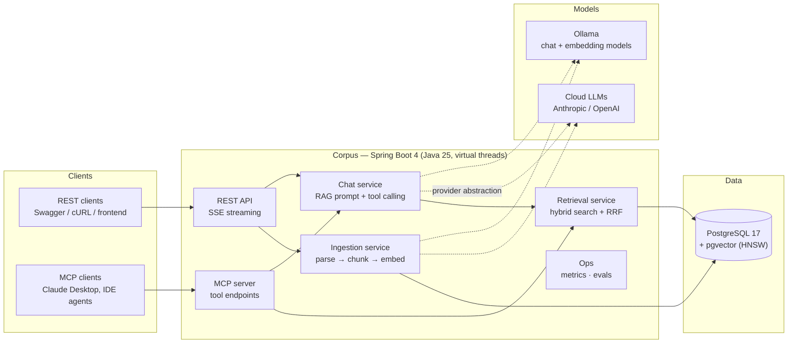

# Corpus — AI Document Assistant

> **Chat with your documents.** A production-grade RAG (Retrieval-Augmented Generation) service built with Spring Boot 4, Spring AI 2.0, and PostgreSQL/pgvector — exposing its knowledge both as a REST API and as an **MCP (Model Context Protocol) server** that Claude Desktop and other AI clients can call as a tool.


---

## What it does

Corpus lets a user upload documents (PDF, Markdown, DOCX, TXT), then ask questions about them in natural language and receive **streamed, citation-backed answers**. Under the hood it runs a full retrieval-augmented generation pipeline: documents are chunked and embedded, stored in PostgreSQL with pgvector, retrieved with **hybrid search** (keyword + vector, fused with Reciprocal Rank Fusion), and injected into an LLM prompt with source attribution.

Three things make it more than a tutorial RAG app:

1. **It is an MCP server.** Any MCP-compatible client (Claude Desktop, IDE agents, other LLM apps) can connect to Corpus over streamable HTTP and use `search_documents` / `ask_documents` / `list_documents` as native tools — turning your document store into part of the agentic AI ecosystem. Setup guide: [docs/mcp-setup.md](docs/mcp-setup.md).
2. **It measures itself.** A built-in evaluation harness scores retrieval quality (recall@5, MRR) and answer faithfulness against a golden dataset, and fails CI if quality regresses. Current numbers on the seeded corpus: **recall@5 = 1.000, MRR = 0.854**. Token usage and estimated cost are tracked per request via Micrometer.
3. **It runs anywhere, keyless.** The `local` profile uses Ollama for chat and embeddings, so anyone can clone the repo and run the full stack with `docker compose up` — no API key required. The `cloud` profile switches to Anthropic or OpenAI with zero code changes. CI runs entirely keyless on an in-process ONNX embedding model and a deterministic stub chat model.

## If you're reviewing this repo, start here

- 🔌 **MCP integration** — [`mcp/CorpusMcpTools.java`](src/main/java/dev/ahmeddyounis/corpus/mcp/CorpusMcpTools.java) and [docs/mcp-setup.md](docs/mcp-setup.md) (connect Claude Desktop, then record your own demo)
- 🧪 **Eval harness** — [`RetrievalEvalTest`](src/test/java/dev/ahmeddyounis/corpus/evals/RetrievalEvalTest.java), [`AnswerQualityEvalTest`](src/test/java/dev/ahmeddyounis/corpus/evals/AnswerQualityEvalTest.java), and [`evals/golden-set.yaml`](evals/golden-set.yaml)
- 🔍 **Hybrid search + RRF** — [`retrieval/RetrievalService.java`](src/main/java/dev/ahmeddyounis/corpus/retrieval/RetrievalService.java), [`retrieval/RrfFuser.java`](src/main/java/dev/ahmeddyounis/corpus/retrieval/RrfFuser.java)
- 📈 **Token & cost metrics** — [`ops/RagMetrics.java`](src/main/java/dev/ahmeddyounis/corpus/ops/RagMetrics.java), `/actuator/prometheus`, [Grafana dashboard](docs/grafana-dashboard.json)
- 📐 **Design decisions (ADRs)** — [docs/decisions/](docs/decisions/)

---

## Features

- **Document ingestion pipeline** — upload → parse (Apache Tika) → token-aware chunking with overlap → batch embedding → pgvector storage with HNSW index
- **Hybrid retrieval** — PostgreSQL full-text search (`tsvector`) + cosine similarity over embeddings, merged with Reciprocal Rank Fusion for better recall than either alone
- **Conversational RAG chat** — Spring AI `ChatClient` with a memory advisor, per-conversation JDBC-backed history, and **SSE token streaming** to the client
- **Inline citations** — every answer references the chunk IDs and source documents it drew from (`citations` SSE event; `[n]` markers in answers)
- **MCP server** — exposes `search_documents`, `ask_documents`, and `list_documents` tools over streamable HTTP at `/mcp`
- **Agentic tool calling** — the chat model can invoke an internal document-metadata tool (Spring AI function calling with user-scoped `ToolContext`)
- **Provider-agnostic models** — swap Anthropic ↔ OpenAI ↔ Ollama through configuration only
- **Evaluation harness** — golden Q&A set, retrieval metrics (recall@5, MRR), LLM-as-judge faithfulness scoring, wired into CI
- **LLM observability** — Micrometer metrics for token usage, per-phase latency, and estimated cost per request; Prometheus endpoint; pre-built Grafana dashboard
- **Security** — stateless JWT auth (Spring Security), per-user document scoping enforced at the storage layer, request rate limiting (Bucket4j)
- **Production hygiene** — Testcontainers integration tests (95% line coverage on core packages, 80% gate), GitHub Actions CI, docker-compose one-command startup, virtual threads enabled

---

## Architecture



**Style: a modular monolith.** One deployable Spring Boot application with strict package boundaries (`ingestion`, `retrieval`, `chat`, `mcp`, `ops`, `security`). This is deliberate — see [ADR 0001](docs/decisions/0001-modular-monolith.md).

### Request flow (chat)

1. Client `POST /api/chat` with a question (JWT required).
2. The chat service calls the retrieval service with the user's query.
3. Retrieval runs **two searches in parallel** (virtual threads): full-text and vector similarity, both scoped to the user's documents.
4. Results are fused with Reciprocal Rank Fusion; top-k chunks are selected.
5. Numbered context chunks + citation instructions are injected into the prompt; conversation memory is appended by the memory advisor.
6. The model's response **streams back over SSE** (`token` events), followed by `citations`, `usage` (tokens, estimated cost, phase latencies), and `done` events.
7. Metrics are recorded (tokens in/out, per-phase latency, estimated cost, retrieval scores).

---

## Tech stack

| Layer | Technology | Notes |
|---|---|---|
| Language | **Java 25 (LTS)** | Virtual threads enabled (`spring.threads.virtual.enabled=true`) |
| Framework | **Spring Boot 4.0** | Web MVC + SSE, Actuator, Security |
| AI framework | **Spring AI 2.0** | `ChatClient`, advisors, function calling, MCP server, vector store abstraction |
| Chat models | Anthropic Claude / OpenAI (cloud) · Ollama `qwen3:4b` (local) | Selected by Spring profile + `spring.ai.model.chat` |
| Embeddings | `nomic-embed-text` via Ollama (local) · **ONNX all-MiniLM-L6-v2** in CI/cloud-default (keyless, in-process) · OpenAI (opt-in) | Dimension is part of the schema — see [Configuration](#configuration) |
| Vector + relational store | **PostgreSQL 17 + pgvector** | Single datastore; HNSW index; full-text via generated `tsvector`; all DDL via Flyway |
| Document parsing | Apache Tika | PDF, DOCX, MD, TXT |
| AuthN/Z | Spring Security + JWT (HS256) | Stateless; per-user scoping in SQL + vector filters |
| Rate limiting | Bucket4j | Per-user token buckets, 429 + `Retry-After` |
| Observability | Micrometer → Prometheus (+ Grafana dashboard) | Token, cost, phase-latency, retrieval-quality metrics |
| Testing | JUnit 5, Testcontainers (pgvector), Awaitility | Real Postgres in integration tests; deterministic stub chat model |
| CI/CD | GitHub Actions | Keyless build+evals on PR; nightly judge evals |
| Packaging | Docker, docker-compose | One-command local stack |

---

## API reference

| Method | Path | Description |
|---|---|---|
| `POST` | `/api/auth/token` | Issue a JWT (demo `demo`/`demo` seeded in keyless profiles) |
| `GET` | `/api/auth/me` | The authenticated user |
| `POST` | `/api/documents` | Upload a document (multipart `file`); triggers async ingestion, returns 202 |
| `GET` | `/api/documents` | List the caller's documents + ingestion status |
| `DELETE` | `/api/documents/{id}` | Remove a document and its chunks/embeddings |
| `POST` | `/api/search` | Retrieval only — ranked chunks with RRF/vector/FTS scores (debug/inspection) |
| `POST` | `/api/chat` | Ask a question; **SSE stream**: `token`* → `citations` → `usage` → `done` |
| `GET` | `/api/conversations/{id}` | Conversation metadata + message history |
| `GET` | `/actuator/health` \| `/actuator/prometheus` | Health & metrics |

Interactive docs: `http://localhost:8080/swagger-ui.html`.

**MCP endpoint:** streamable HTTP at `/mcp` exposing `search_documents`, `ask_documents`, `list_documents`. Claude Desktop setup: [docs/mcp-setup.md](docs/mcp-setup.md).

---

## Getting started

### Prerequisites

- Docker + Docker Compose
- (Optional, `cloud` profile) an Anthropic or OpenAI API key

### Run fully local — no API key

```bash
git clone https://github.com/ahmeddyounis/corpus && cd corpus
docker compose up --build
```

- App: http://localhost:8080/swagger-ui.html · Metrics: http://localhost:8080/actuator/prometheus
- Postgres is published on host port **5433** (to avoid clashing with a local Postgres).
- First run pulls the Ollama chat + embedding models (**several GB**) via the one-shot `ollama-init` service; later starts are fast.
- The demo user (`demo`/`demo`) is seeded along with eight sample documents about the system itself — ask it questions about HNSW tuning, chunking, or JWTs.

Add Prometheus + Grafana (provisioned dashboard at http://localhost:3000):

```bash
docker compose --profile monitoring up -d
```

### Run against a cloud model

```bash
docker compose up -d postgres
export SPRING_PROFILES_ACTIVE=cloud
export ANTHROPIC_API_KEY=sk-ant-...   # or OPENAI_API_KEY + CORPUS_CHAT_PROVIDER=openai
./gradlew bootRun
```

Cloud chat defaults to Anthropic (`claude-sonnet-4-5`); embeddings default to the **in-process ONNX model** so no second API key is needed. Opt into OpenAI embeddings with `CORPUS_EMBEDDING_PROVIDER=openai CORPUS_EMBEDDING_DIMENSION=1536` (requires a wipe — see below).

### Try it

```bash
TOKEN=$(curl -s -X POST localhost:8080/api/auth/token \
  -H 'Content-Type: application/json' \
  -d '{"username":"demo","password":"demo"}' | jq -r .token)

curl -X POST localhost:8080/api/documents \
  -H "Authorization: Bearer $TOKEN" -F file=@mydoc.pdf

curl -N -X POST localhost:8080/api/chat \
  -H "Authorization: Bearer $TOKEN" \
  -H 'Content-Type: application/json' -H 'Accept: text/event-stream' \
  -d '{"message":"Summarize the termination clause and cite the source."}'
```

---

## Configuration

| Variable | Default | Purpose |
|---|---|---|
| `SPRING_PROFILES_ACTIVE` | `local` | `local` (Ollama) · `cloud` (Anthropic/OpenAI) · `keyless` (no chat; ingestion+search only) |
| `ANTHROPIC_API_KEY` / `OPENAI_API_KEY` | — | Cloud provider credentials (`cloud` profile) |
| `CORPUS_CHAT_PROVIDER` | `anthropic` | Cloud chat provider: `anthropic` or `openai` |
| `CORPUS_CHAT_MODEL` | profile-dependent | Chat model id (`qwen3:4b` local, `claude-sonnet-4-5` cloud) |
| `CORPUS_EMBEDDING_PROVIDER` | `transformers` (cloud) | `transformers` (in-process ONNX) or `openai` |
| `CORPUS_EMBEDDING_MODEL` | profile-dependent | Embedding model id (`nomic-embed-text` local) |
| `CORPUS_EMBEDDING_DIMENSION` | profile-dependent | Must match the model — see matrix below |
| `CORPUS_CHUNK_SIZE` / `CORPUS_CHUNK_OVERLAP` | `512` / `64` (tokens) | Chunking strategy (cl100k_base) |
| `CORPUS_RETRIEVAL_TOP_K` | `6` | Chunks injected into the prompt |
| `CORPUS_RRF_K` | `60` | Reciprocal Rank Fusion constant |
| `CORPUS_JWT_SECRET` | dev value | HMAC secret for JWT (≥32 bytes; override outside dev) |
| `CORPUS_RATE_LIMIT_RPM` | `30` | Per-user requests/minute |

### Embedding dimension matrix

The embedding dimension is baked into the `vector_store` schema. **Switching embedding models requires a wipe + re-ingest:** `docker compose down -v && docker compose up`. A startup guard refuses to boot on a mismatch and tells you exactly that.

| Profile | Embedding model | Dimension |
|---|---|---|
| `test` / CI / `keyless` | ONNX all-MiniLM-L6-v2 (in-process) | 384 |
| `local` | `nomic-embed-text` (Ollama) | 768 |
| `cloud` (default) | ONNX all-MiniLM-L6-v2 (in-process) | 384 |
| `cloud` + OpenAI embeddings | `text-embedding-3-small` | 1536 |

---

## Evaluation harness

Quality is a feature. Corpus ships with [`evals/golden-set.yaml`](evals/golden-set.yaml) — 16 question → expected-source → reference-answer cases over the seeded sample documents, one keyword-flavored and one paraphrase question per document (so each retrieval leg is exercised).

| Metric | What it measures | Gate | Current |
|---|---|---|---|
| `recall@5` | Did retrieval surface the correct source in the top 5? | ≥ 0.85 | **1.000** |
| `MRR` | How high does the correct source rank? | ≥ 0.70 | **0.854** |
| Faithfulness (LLM-as-judge) | Is the answer grounded in retrieved context? | ≥ 0.80 | nightly |
| Answer relevance (LLM-as-judge) | Does the answer address the question? | ≥ 0.80 | nightly |

- **Retrieval metrics run on every PR** (`./gradlew test`) using the in-process ONNX embedding model — deterministic and keyless, with a per-case report in the test output.
- **Judge-based metrics run nightly** (`./gradlew nightlyEval` with `ANTHROPIC_API_KEY`; the scheduled workflow publishes the JSON report to the run summary and fails on threshold breach).

This turns "the bot seems fine" into a tracked, enforced quality bar — and gives you before/after numbers when you tune chunking, k, or prompts. Methodology: [ADR 0007](docs/decisions/0007-keyless-ci-and-evals.md).

---

## Observability

- **Token & cost tracking** — per-request usage from Spring AI metadata → `corpus_llm_tokens_total{direction,model,provider}` and `corpus_llm_cost_estimate_usd_total` via a configurable price table (`corpus.pricing.models.*`).
- **Latency** — `corpus_rag_phase_seconds` histogram timers per phase: `embedding`, `retrieval`, `first_token`, `full_response`.
- **Retrieval quality signals** — `corpus_retrieval_top_score` and `corpus_retrieval_score_spread` gauges to spot degraded retrieval in production.
- Exposed via `/actuator/prometheus`; `docker compose --profile monitoring up` adds Prometheus + a provisioned Grafana dashboard ([docs/grafana-dashboard.json](docs/grafana-dashboard.json)).

---

## Testing strategy

| Level | Scope | Tooling |
|---|---|---|
| Unit | Chunker windows/overlap, RRF fusion, bucket semantics | JUnit 5 |
| Integration | Ingestion → retrieval → chat round-trips against **real Postgres+pgvector** | Testcontainers, ONNX embeddings, stub chat model |
| Contract | REST + SSE event framing, MCP JSON-RPC handshake + tool calls, per-user scoping | Raw JDK HttpClient assertions |
| Eval (PR) | recall@5, MRR on the golden set | Deterministic, keyless |
| Eval (nightly) | Faithfulness & relevance, judge-scored | Real model via secret |

Coverage gate via JaCoCo: ≥ 80% line coverage on `ingestion`/`retrieval`/`chat`/`security` (currently ~95%).

---

## CI/CD

- **`ci.yml`** — on PR/push: build, unit + integration + PR-tier evals (Testcontainers + cached ONNX model), JaCoCo gate, Docker image build.
- **`eval-nightly.yml`** — scheduled: judge evals against a live model (repo secret `ANTHROPIC_API_KEY`), report posted to the run summary; fails loudly on threshold breach.
- Dependabot for Gradle, Actions, and Docker bumps (Spring AI moves fast — this stays visible).

---

## Project structure

```
corpus/
├── .github/workflows/         # ci.yml, eval-nightly.yml
├── docker-compose.yml         # app + pgvector + ollama (+ monitoring profile)
├── docker/                    # prometheus config, grafana provisioning
├── evals/golden-set.yaml      # eval ground truth
├── docs/
│   ├── mcp-setup.md           # Claude Desktop connection guide
│   ├── grafana-dashboard.json
│   └── decisions/             # ADRs 0001–0007
└── src/
    ├── main/java/dev/ahmeddyounis/corpus/
    │   ├── ingestion/         # Tika parse, TokenChunker, async pipeline
    │   ├── retrieval/         # hybrid search, RrfFuser, FullTextSearchDao
    │   ├── chat/              # ChatClient config, SSE streaming, memory, citations, tools
    │   ├── mcp/               # @McpTool definitions + identity resolution
    │   ├── ops/               # RagMetrics, CostEstimator, DimensionGuard
    │   ├── security/          # JWT, rate limiting, user scoping
    │   └── config/            # executors, demo seeding
    ├── main/resources/
    │   ├── db/migration/      # Flyway-owned DDL incl. vector store + tsvector
    │   └── samples/           # seeded demo corpus (the golden set's subject)
    └── test/java/...          # mirrors main; evals under evals/
```

---

## Design decisions & trade-offs

Full ADRs in [docs/decisions/](docs/decisions/); summaries:

1. **[PostgreSQL + pgvector over a dedicated vector DB](docs/decisions/0002-postgres-pgvector-single-store.md).** One datastore, transactional consistency, honest capacity for this scale; the vector store sits behind Spring AI's abstraction so migration is contained.
2. **[Hybrid search with RRF over vector-only](docs/decisions/0003-hybrid-retrieval-rrf.md).** Vector search misses exact identifiers; keyword search misses paraphrases. RRF is parameter-light and measurably better on the golden set.
3. **[Modular monolith over microservices](docs/decisions/0001-modular-monolith.md).** One deployable, reviewable in a sitting, with explicit seams where services would split.
4. **MCP server instead of API-only.** REST serves humans; MCP makes Corpus consumable by AI agents with the same identity model ([ADR 0006](docs/decisions/0006-jwt-and-mcp-access.md)).
5. **Provider abstraction with a local-first default.** Ollama default = zero-cost onboarding and no secrets in CI; cloud profile = production realism; cost is a first-class metric.
6. **[Evals in CI](docs/decisions/0007-keyless-ci-and-evals.md).** LLM apps regress silently; automated retrieval/faithfulness gates make quality a build artifact instead of a vibe.
7. **[Virtual threads over reactive](docs/decisions/0005-sse-on-virtual-threads.md).** RAG is I/O-bound fan-out; virtual threads keep the concurrency win with a blocking, debuggable programming model.

---

## Roadmap

- [ ] Cross-encoder **reranking** stage after RRF (measure the bump with the eval harness)
- [ ] **Semantic response caching** to cut token spend on near-duplicate questions
- [ ] Multi-tenancy: organizations, roles, and document-level ACLs
- [ ] Minimal React frontend (chat + upload + citations UI)
- [ ] Record `docs/demo.gif` — Claude Desktop calling Corpus via MCP (see [docs/mcp-setup.md](docs/mcp-setup.md))
- [ ] Helm chart / k8s manifests

---

## License

MIT — see [LICENSE](LICENSE).

---

*Built as a portfolio project to demonstrate production-grade LLM engineering on the JVM: RAG, hybrid retrieval, agentic tool calling via MCP, evaluation-driven development, and LLM observability — all on a current Spring Boot 4 / Spring AI 2.0 / Java 25 stack.*
